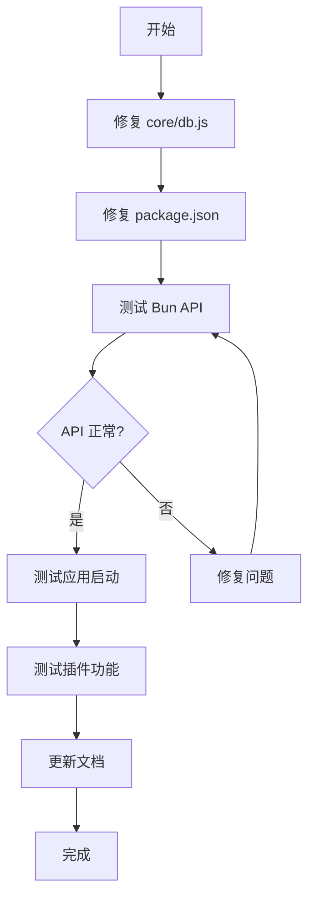

# Bun迁移项目 - 任务计划

## 当前状态分析

### 已确认的问题

#### 1. core/db.js - 错误的Bun API使用 ⚠️ 高优先级

**问题代码（第4-7行）：**
```javascript
const dbDir = Bun.dirname(config.app.dbPath);  // ❌ Bun.dirname不存在
if (!Bun.exists(dbDir)) {                       // ❌ Bun.exists不存在
  Bun.mkdir(dbDir, { recursive: true });        // ❌ Bun.mkdir不存在
}
```

**修复方案：**
```javascript
import { dirname } from 'path';
import { existsSync, mkdirSync } from 'fs';

const dbDir = dirname(config.app.dbPath);
if (!existsSync(dbDir)) {
  mkdirSync(dbDir, { recursive: true });
}
```

#### 2. package.json - 入口路径错误 ⚠️ 高优先级

**当前配置：**
```json
"main": "src/index.js",
"scripts": {
  "start": "bun src/index.js",
  "dev": "bun --watch src/index.js"
}
```

**应改为：**
```json
"main": "index.js",
"scripts": {
  "start": "bun index.js",
  "dev": "bun --watch index.js"
}
```

#### 3. core/config.js - 需验证
- 使用顶层 `await Bun.file().text()` 
- 使用 `Bun.TOML.parse()`
- 使用 `Bun.resolveSync()`
- **状态：** 需要实际运行测试

#### 4. core/scheduler.js - 需验证
- 使用 `Bun.CryptoHasher.hash('md5', data)`
- **状态：** 需要实际运行测试

#### 5. core/validator.js - 需验证
- 使用 `Bun.connect({hostname, port, socket})`
- **状态：** 需要实际运行测试

#### 6. core/auth.js - 已修复 ✅
- 正确使用 `Bun.file()` 和 `await file.text()`

#### 7. 插件导入路径 - 已修复 ✅
- 使用 `../../utils/...` 正确

---

## 任务执行计划

### 第一阶段：核心修复

| 序号 | 任务 | 状态 | 说明 |
|------|------|------|------|
| 1.1 | 修复 core/db.js | 待执行 | 替换为 path/fs 模块 |
| 1.2 | 修复 package.json | 待执行 | 更新入口路径 |

### 第二阶段：验证测试

| 序号 | 任务 | 状态 | 说明 |
|------|------|------|------|
| 2.1 | 测试 Bun API 可用性 | 待执行 | 运行测试脚本 |
| 2.2 | 测试应用启动 | 待执行 | bun run index.js |
| 2.3 | 测试插件加载 | 待执行 | 验证代理收集 |

### 第三阶段：文档更新

| 序号 | 任务 | 状态 | 说明 |
|------|------|------|------|
| 3.1 | 更新 README.md | 待执行 | 反映 Bun 架构 |

---

## 执行命令参考

```bash
# 测试 Bun API 可用性
bun -e "console.log('Bun.file:', typeof Bun.file)"

# 测试应用启动
bun run index.js

# 测试构建（如需要）
bun run build.js
```

---

## Mermaid 工作流程



---

*创建时间: 2026-03-15*
*模式: Architect*
